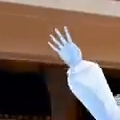
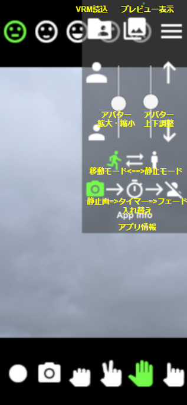
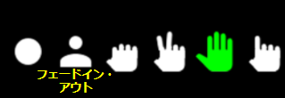
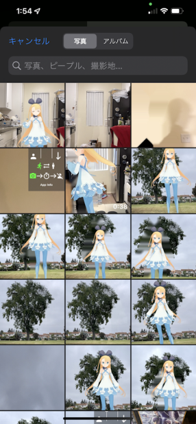

# KigurumiAR
- KigurumiAR(きぐるみあ)は、着ぐるみのようにVRMアバターを身に着けて気軽に静止画、動画を撮影できるアプリです。
- リアルの被写体の人の姿はカメラの視界から消去され、代わりに人と同じ動きをするVRMアバターがリアルタイムに表示されます。
- Apple製のA12プロセッサ以降を搭載したiOSデバイス（iPhone/iPad）に対応しています。

## [KigurumiAR Discordチャンネル(クローズドベータテスター限定です)](https://discord.gg/pYF9v758)
**クローズドベータテストでは、アプリのスクリーンショットや撮影した動画、静止画をSNSなどのオープンな場でシェアしないでください。**

## 機能紹介
### VRMモデル読込
VRMフォーマットに準拠した任意のモデルを読み込んで、3Dアバターとして使用する事が出来ます。

[VRMフォーマットについて](https://vrm.dev/)

### 3Dポーズトラッキング
カメラの視界に入った人物のポーズ（手足の角度）を認識して、3Dアバターに反映させることができます

### 人物消去、フェードイン/アウト
カメラの視界に入った人物は、ポーズを認識されると同時に消去されて背景と同化するよう処理され、人物の姿を3Dアバターに置き換える事が出来ます。 
リアル人物<-->3Dアバターでこの消去処理をフェードイン、フェードアウトさせて「変身」の演出を動画撮影することも出来ます。 

 

**綺麗に人物消去を行うには、被写体、撮影の双方で注意する点があります。詳しくは使い方の撮影とtipsを参照ください**

### リップシンク
表示された3Dアバターは、入力される音声によってリップシンク（口パク）を行うことができます。 
リップシンク機能の実装には凹み氏作の[uLipSync](https://github.com/hecomi/uLipSync)を使用させていただいています。 

 
### 表情、手の表現
表情はニュートラルと喜怒哀楽の5種類、手はグー、チョキ、パー、指差しの4種類をアプリ画面上から随時選択する事が出来ます。 

 

### キーボードショートカット
撮影操作、フェードイン・アウト、上記の表情、手の表現はBluetoothなどで接続されたキーボードによる遠隔入力が可能です。詳しくは使い方を参照ください。

### 床面認識
撮影環境内の床面や地面を自動で認識して、3Dアバターの影を落とすことができます。（まだ検証中です） 
足元を含めて撮影する場合により「地に足の着いた」表現が出来るようになります。

### 照明推定
自動で照明環境を推定して、光源の角度や色を取得して反映します。（まだ検証中です） 

-----

## 実行環境
Apple製のA12プロセッサ以降を搭載したiOSデバイス 
**LiDAR搭載機種(iPhone12Pro/Pro Max、iPad Pro 11インチ（第2世代）、12.9インチ（第3世代）を推奨)**
- [x] iPhone 12 Pro Max
- [ ] iPhone 12 Pro
- [ ] iPhone 12
- [ ] iPhone 12 mini
- [ ] iPhone 11 Pro Max
- [x] iPhone 11 Pro
- [x] iPhone 11
- [x] iPhone SE (第2世代)
- [x] iPhone XS Max
- [x] iPhone XS
- [x] iPhone XR
- [x] iPad Pro 12.9 インチ (第4世代)
- [ ] iPad Pro 12.9 インチ (第3世代)
- [ ] iPad Pro 11 インチ (第2世代)
- [ ] iPad Pro 11 インチ
- [ ] iPad Air (第3世代)
- [ ] iPad Air (第4世代)
- [ ] iPad 10.2 インチ (第8世代)
- [x] iPad mini (第5世代)

- [x] 動作確認済み

[参考ページ(英語)](https://developer.apple.com/augmented-reality/arkit/)

-----

## 使い方
### 各部名称

 
 

### キーボード入力 (オプション)
- **Enter**: 動画撮影ボタン
- **Space**: 静止画撮影ボタン
- **A**: フェードイン・アウト
- **Z**: グー（手）
- **X**: チョキ（手）
- **C**: パー（手）
- **V**: 指差し（手）
- **BS**: Neutral(表情)
- **↑**: Fun(表情)
- **→**: Joy(表情)
- **←**: Angry(表情)
- **↓**: Sorrow(表情)

### VRMモデル読み込み
アプリを起動して数秒すると、現在選択されているVRMモデルが自動的に読み込まれ、目の前に短時間表示されます。
- 現在のモデルと異なるVRMモデルを使用したい場合は、**メニューボタンを押してメニューを出し、VRMモデル読込ボタンを押してVRMファイルを選択します。** 
Safariブラウザでダウンロードした場合はダウンロードフォルダに、Chromeブラウザの場合はChromeフォルダに保存されています。 
- ファイル選択後、**VRMモデルをアバターとして使用する場合の許諾範囲・条件が表示されます。ユーザー本人が使用可能であることを確認してLoadボタンを押してください。** 

ダウンロードしたファイルがzip形式の場合は、あらかじめ他のアプリ（ファイルなど）で解凍してVRMファイルを出力してください。 
**インストール直後は[アリシア・ソリッドちゃん](https://3d.nicovideo.jp/alicia/)がロードされており、VRMファイルを選択しなくても(規約の範囲内で)すぐ撮影が可能です**

### 撮影準備
通常の写真撮影と同じく、一人の場合と二人以上の場合では準備する物が異なります（全身をフレームに収める必要があるため、手持ちでの自撮りには対応していません）。 
- 一人の場合: **iPhone/iPad本体をスマートフォンを固定できる三脚などに固定します。撮影中に表情や手を変えたい場合は、小型BluetoothキーボードをiPhone/iPad本体に接続して使えるようにします**
- 二人の場合: **iPhone/iPad本体のみ** (三脚があればより高画質で撮影できます) 
- 一度、被写体の人物の全身をカメラの視界内に入れた後（一人撮影の場合は一度入ったあとは視界から外れても大丈夫です）、メニュー内のアバター拡大/縮小でアバターの大きさを調整してください。 
- 同様に、アバターの足が地についていない場合は、カメラを地面に向けて動かしながらアバターの上下移動で調整してください。これらの調整中は、プレビューとしてTポーズのアバターが一時的に表示されます。 
- 撮影状況に応じて移動モード、静止モードを選択します（デフォルトは移動モードに設定）。基本的にカメラが移動する場合は移動モード、固定あるいはその場で回転のみの場合は静止モードを選択します。条件が揃えば、静止モードの方が高画質で人物の消去が可能です。ただし、被写体がアプリ起動時から動かず、背景が一度も撮影されない場合は移動モードを選択してください。  

 
    移動モード　　　　　　　　　静止モード

後述する音声入力が必要な場合は、AirPodsなどの音声入力可能なBluetoothヘッドホン/イヤホンも準備して接続しておきます。

### 撮影
- アプリ開始時、カメラの視界内に人がいない、あるいは認識されないほど遠くにいる事を確認してください。人が認識されると人物消去処理が有効になります(※誤認識する場合もあります。tipsを参照してください)
- iPhone/iPadから**2~4m離れた所からカメラの視界に入って、全身がカメラに映るように視界の真ん中まで移動してください（端にいたままだと背景にゴミが残ることがあります）**

- 人物が正常に消去され、同じ動きをする3Dアバターが出現している事を確認してください。
- **動画撮影ボタンで動画撮影を行います。** 動画撮影ボタンを押すとアイコンが白い〇から赤い■に変わり、撮影を始めます。もう一度押すと動画撮影を終了します。撮影された動画は「写真」アプリで閲覧できます。
- **静止画撮影ボタンで動画撮影を行います。** 静止画撮影ボタンを押すと画面が一瞬白飛びして撮影したことを通知します。撮影された静止画は「写真」アプリで閲覧できます。
- **一人で撮影する場合は、メニュー上で静止画=>タイマー=>フェード入れ替えボタンをで静止画撮影をセルフタイマーに入れ替えると便利です**。タイマーボタン押下で10秒後に静止画撮影します。もう一度押すと撮影がキャンセルされます。
- もし撮影されたアバターの大きさや上下位置が適切でない場合は、再度メニューのアバター拡大/縮小と上下移動で調整してください。
- 撮影時、非撮影時に関わらず、画面上のボタンやキーボード入力でいつでも表情や手を変化させることができます。
- 同様にフェードイン・アウトの操作も可能です。動画撮影時に「変身」の演出として活用できます。**画面上にフェードイン・アウトボタンを出すには、メニュー上で静止画=>タイマー=>フェード入れ替えボタンを押してボタンの入れ替えを行ってください。**
- **人物消去のクオリティを維持するために、静止モードでの撮影時はカメラを動かさない事を推奨します。** カメラをその場でパン（回転）する動作には対応していますが、人物消去した背景にズレが生じる事があります。カメラを移動しながら撮影する場合は、移動モードを選択してください。

### プレビュー

- 撮影後、メニュー内の「プレビュー表示」を押す事で、静止画や動画を確認する事が出来ます。
- 静止画は現在の画面の上に重ねて表示されます。画像をタップすると閉じる事が出来ます。
- 動画は全画面表示され、再生、拡大、シークバー（±15秒スキップ可能）、音量調節（ミュート可能）を行う事が出来ます。Xを押すと閉じます。また、再生が終了すると自動的に閉じます。

### 音声入力
動画撮影時に音声を収録したい場合は、AirPodsなどの音声入力可能なBluetoothヘッドホン/イヤホンを使用して音声入力が可能です。
入力された音声の母音に応じて3Dアバターがリップシンクを行います。被写体でなく、撮影者が音声入力する場合はiPhone/iPadのマイクを直接使用する事も出来ます。 
**ヘッドホン使用時にエコーバック確認のために入力された音声がアプリから出力されます。エコーバックが不要な場合はボリュームを下げた状態でアプリを使用してください**

### その他tips
- **人物消去を行い、アバターに置き換わる対象は一人に限られます。** 誤認識が起きやすくなるため、カメラの視界内に他の人が入らないようにしてください。
- 人体の一部が写らない場合、その部分のトラッキングが不安定になります。なるべく全身が含まれるようフレーミングしてください。
- 同じ被写体で同じVRMモデルを使用する場合、3Dアバターの高さ、大きさの調整は一度で済みます。 
**前回の選択モデルと調節結果は保存されるため、本撮影前に事前に調整しておくと撮影がスムーズに行えます。**
- 現在、顔の向きは正確にトラッキングできないため、**身体がカメラに向かって正面45°の範囲を向いている時はアバターの顔がカメラに向く** よう設定されています。
また、それ以上の角度ではカメラ目線を維持するようになっています。
- 撮影距離が遠すぎるとポーズトラッキングが安定せず、近すぎると人物の認識が行われなくなります。何度か試して適切な距離感を掴んでみてください。
- 人物が完全に消去されず、**一部領域にゴミが残る場合は左右に動いてみてください。**
- 人物消去、3Dポーズトラッキングは背景などの環境によって誤認識を起こすことがあります。 **うまく撮影できない場合は、場所（写る背景）を変えて試してみてください。**
- 人物の姿勢によっては3Dポーズトラッキングの認識が正確に行えない場合があります。色々なポーズを試してみて、うまく認識できる場合、できない場合を確かめつつ撮影してみてください。
- スカートを着ていると、下半身のポーズトラッキングが安定しない場合があります。**撮影時にはパンツルックをお勧めします。** <r>
また、服装や髪形によっては前向き、後ろ向きを誤認しやすくなる場合があります。
- 日中の屋外など、リアル人物の強い影が落ちる環境だと、アプリの光源推定で描画される影と矛盾した表示になる事があります。 
アプリ開始時の向きで光源推定結果が変わる事があるのでこれで調整したり、足元を写さないなどで暫定対応してください。
- 特に狭い屋内での撮影の場合、**人物と背景が近いと人物の影が背景に落ちる** 事があり、その場合は人物を綺麗に消去する事が出来ません。背景と距離を取る、光源との位置関係を調整するなどで対処する必要があります。
- ランドスケープ（横位置）でも人物消去、3Dアバターの表示は可能ですが、撮影される静止画、動画は縦長のままになるため、現時点では編集アプリなどで90°回転させる必要があります

## 今後の予定（優先順位順）
- [ ] 光源推定、影の改善（影描画のオン・オフなど）
- [ ] VRM連携サービス対応（現時点ではVRoid Hubを想定）
- [ ] ランドスケープ（横位置）での撮影対応
- [ ] 人物消去の品質改善
- [ ] iOS多機種対応
- [ ] Android版リリース
- [ ] カメラの併進移動対応（できればやりたい）

## 更新履歴
- 2021/04/13 v0.8.0公開
- 2021/05/40 v0.8.0.5公開（セルフタイマー、VRMプレビュー追加）

## お問い合わせ
- [公式discordチャンネル](https://discord.gg/pYF9v758)
- [Twitter](https://twitter.com/AmadeusSVX)
